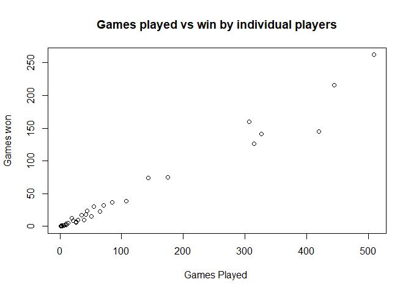
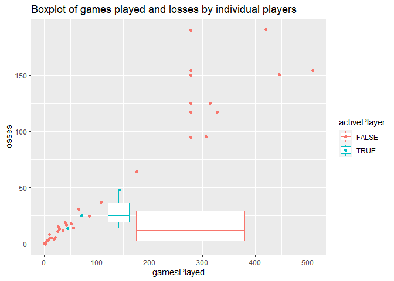
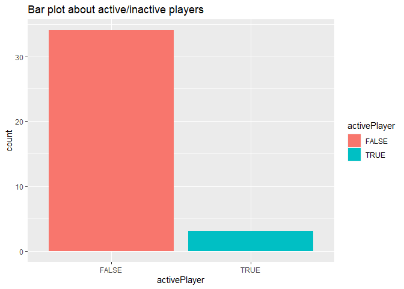
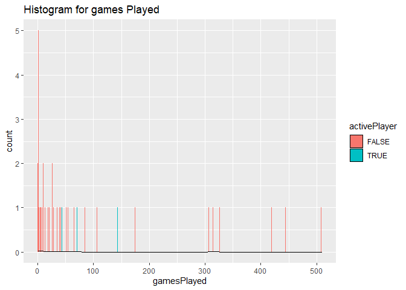
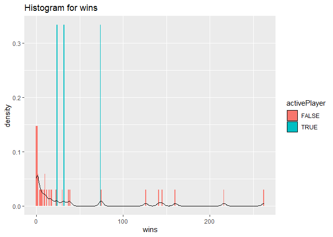
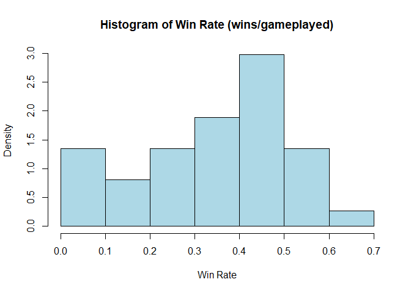

Project-1, ST558
================
Pratap Adhikari
9/18/2020

### Function to get franchiseAPI

``` r
nhl<- function(tabName, ID=NULL, ...){
  base_url<- "https://records.nhl.com/site/api"
  if (!is.null(tabName)){
 
     if ( tabName %in% c("franchise", "franchise-team-totals") && (!is.null(ID))){
    stop("This tab can not return with 'ID' defined")
  }
  
    if (is.null(ID)){ 
    full_url<- paste0(base_url, "/", tabName) 
  }
  
    if (!is.null(ID)){
     full_url<- paste0(base_url, "/", tabName, ID) 
  }
  get_nfl<- GET(full_url)
  txt_nfl<- content(get_nfl, "text")  # convert to JSON text form
  json_nfl<- fromJSON(txt_nfl, flatten=T) # convert to list
return(json_nfl)
  }
  else {
    return("Invalid tabName")
  }
}
```

### Function to get statsAPI

``` r
nhl_modifier<- function(modifier, ID=NULL,...){
  stbase_url<- "https://statsapi.web.nhl.com/api/v1/teams"
  if (modifier %in%  c("expand=team.roster", "expand=person.names", "expand=team.schedule.next", "expand=team.schedule.previous",  "expand=team.stats",  "expand=team.roster&season=20142015", "teamId=4,5,29",  "stats=statsSingleSeasonPlayoffs"))
  {
    get_st<- GET(paste0(stbase_url, "?", modifier))
st_txt<- content(get_st, "text")
json_st<- fromJSON(st_txt, flatten=T)

}
else {
  json_st="Sorry, can't accept this modifier"
  
}
return(json_st)
}
```

``` r
nhlData<- function (tabName=NULL, modifier=NULL, ID=NULL, ...){
if (!is.null(tabName) && !is.null(modifier)){
  stop("it can not work together with tabName and modifier")
 
}  
if(is.null(tabName) && is.null(modifier) ){
    
  output<- nhl("franchise")
}
  if (is.null(modifier) && !is.null(tabName)){
     output<- nhl(tabName, ID)
     output<- output$data
  }
  # if modifier is not null and id is null
  if(!is.null(modifier) && is.null(id)){
   output<- nhl_modifier(modifier)
  }
  
  #if both modifier and id are not  null
  if(!is.null(modifier) && !is.null(id) ){
    output<- nhl_modifier(modifier)
    output<- output$teams
    output<- output %>% filter(id==ID) %>% select(id:roster.link)
    
  }
  return(output)
}
```

### Overview of franchise and location

``` r
#teamtotal<- nhl(tabName = "franchise-team-totals") 

#getteams from another endpoint

#division<- nhl_modifier(modifier = "expand=team.roster")$teams %>% select(id, division.name,  locationName, division.nameShort, conference.name) %>% rename(teamId=id)

#join the two dataset from two different APIs

#newData<- left_join(teamtotal, division, by="teamId")
#head(newData, n=4)


# overview of after joining two datasets from two different API endpoints
#kable(head(newData %>% select(id, franchiseId, teamName, locationName)) , caption= "Franchise ID, Team Name, Location  table for your reference:")
```

Read table from two different APIs

``` r
#dta1<- nhlData("franchise")
#dta1<- dta1 %>% select(id, mostRecentTeamId, teamCommonName, teamPlaceName) 

#golietable15<- nhl(tabName  = "franchise-goalie-records?cayenneExp=franchiseId=", ID=15)$data %>% select(activePlayer, firstName, franchiseName, gamesPlayed, lastName, gameTypeId, playerId, ties, wins, losses )
```

## Analysis on team ID=15 (Sallas Stars)

``` r
#Create new variable by adding first and last name from two different columns

golietable15$playerName<- c(paste0(golietable15$firstName, " ", golietable15$lastName))

#select only the varaibles required to analyse the data
golietable15<- golietable15 %>% select(franchiseName, playerName, playerId, activePlayer, gameTypeId, gamesPlayed,ties, wins, losses)
golietable15
```

### Active Players

Table showing active players from the **Dallas** team

``` r
 table (golietable15  %>% group_by(activePlayer)%>% select(franchiseName, activePlayer))
```

    ##               activePlayer
    ## franchiseName  FALSE TRUE
    ##   Dallas Stars    34    3

### Win/Loss Rate

``` r
#create new variables 
wlRate<- golietable15 %>% mutate(tiesRate= round(ties/gamesPlayed, 2), winRate= round(wins/gamesPlayed, 2) , lossRate= round(losses/gamesPlayed,2), MissedClcn= 1-(tiesRate+winRate+lossRate) ) %>% select(playerName, playerId, gameTypeId, gamesPlayed, activePlayer, winRate, lossRate, MissedClcn)
kable(wlRate)
```

| playerName          | playerId | gameTypeId | gamesPlayed | activePlayer | winRate | lossRate | MissedClcn |
| :------------------ | -------: | ---------: | ----------: | :----------- | ------: | -------: | ---------: |
| Don Beaupre         |  8445381 |          2 |         315 | FALSE        |    0.40 |     0.40 |       0.06 |
| Cesare Maniago      |  8450020 |          2 |         420 | FALSE        |    0.35 |     0.45 |       0.03 |
| Marty Turco         |  8460612 |          2 |         509 | FALSE        |    0.51 |     0.30 |       0.14 |
| Kari Lehtonen       |  8470140 |          2 |         445 | FALSE        |    0.49 |     0.34 |       0.17 |
| Ed Belfour          |  8445386 |          2 |         307 | FALSE        |    0.52 |     0.31 |       0.03 |
| Allan Bester        |  8445458 |          2 |          10 | FALSE        |    0.40 |     0.50 |       0.00 |
| Daniel Berthiaume   |  8445462 |          2 |           5 | FALSE        |    0.20 |     0.60 |       0.20 |
| Gary Edwards        |  8446602 |          2 |          51 | FALSE        |    0.29 |     0.35 |       0.07 |
| Brian Hayward       |  8447701 |          2 |          26 | FALSE        |    0.23 |     0.58 |       0.07 |
| Jean Levasseur      |  8448807 |          2 |           1 | FALSE        |    0.00 |     1.00 |       0.00 |
| Markus Mattsson     |  8449291 |          2 |           2 | FALSE        |    0.50 |     0.50 |       0.00 |
| Roland Melanson     |  8449547 |          2 |          26 | FALSE        |    0.27 |     0.42 |       0.12 |
| Gilles Meloche      |  8449550 |          2 |         327 | FALSE        |    0.43 |     0.36 |       0.05 |
| Lindsay Middlebrook |  8449588 |          2 |           3 | FALSE        |    0.00 |     0.00 |       0.33 |
| Andy Moog           |  8449681 |          2 |         175 | FALSE        |    0.43 |     0.37 |       0.05 |
| Gump Worsley        |  8450152 |          2 |         107 | FALSE        |    0.36 |     0.35 |       0.07 |
| Gary Smith          |  8451528 |          2 |          39 | FALSE        |    0.26 |     0.49 |       0.02 |
| Ron Tugnutt         |  8451837 |          2 |          42 | FALSE        |    0.43 |     0.40 |       0.05 |
| Darcy Wakaluk       |  8452248 |          2 |          65 | FALSE        |    0.35 |     0.48 |       0.08 |
| Arturs Irbe         |  8456692 |          2 |          35 | FALSE        |    0.49 |     0.34 |       0.08 |
| Roman Turek         |  8458266 |          2 |          55 | FALSE        |    0.55 |     0.25 |       0.13 |
| Corey Hirsch        |  8458680 |          2 |           2 | FALSE        |    0.00 |     0.50 |       0.50 |
| Tim Thomas          |  8460703 |          2 |           8 | FALSE        |    0.25 |     0.50 |         NA |
| Johan Hedberg       |  8460704 |          2 |          19 | FALSE        |    0.63 |     0.21 |         NA |
| Johan Holmqvist     |  8466303 |          2 |           2 | FALSE        |    0.50 |     0.00 |         NA |
| Andrew Raycroft     |  8467453 |          2 |          29 | FALSE        |    0.34 |     0.45 |         NA |
| Alex Auld           |  8467913 |          2 |          21 | FALSE        |    0.43 |     0.29 |         NA |
| Brent Krahn         |  8468489 |          2 |           1 | FALSE        |    0.00 |     0.00 |         NA |
| Mike McKenna        |  8470093 |          2 |           2 | FALSE        |    0.50 |     0.50 |       0.00 |
| Ben Bishop          |  8471750 |          2 |         143 | TRUE         |    0.52 |     0.34 |       0.14 |
| Jhonas Enroth       |  8473523 |          2 |          13 | FALSE        |    0.38 |     0.38 |         NA |
| Antti Niemi         |  8474550 |          2 |          85 | FALSE        |    0.44 |     0.29 |         NA |
| Anders Lindback     |  8474765 |          2 |          10 | FALSE        |    0.20 |     0.80 |         NA |
| Jussi Rynnas        |  8475680 |          2 |           2 | FALSE        |    0.00 |     0.50 |         NA |
| Cristopher Nilstorp |  8476846 |          2 |           6 | FALSE        |    0.17 |     0.50 |         NA |
| Mike Smith          |  8469608 |          2 |          44 | TRUE         |    0.55 |     0.32 |         NA |
| Anton Khudobin      |  8471418 |          2 |          71 | TRUE         |    0.45 |     0.35 |       0.20 |

Numeric Summary

### Sumamry table

``` r
sumry<- function (x, ...){
  dta<- wlRate %>% filter(gameTypeId == x) %>% select(winRate, lossRate)
  if (x==2) type<- "regular season" else type<- "play off season"
  kable (apply(dta, 2, summary), format="html", digit =4, caption = paste0("Summary among all of the players"))
}

# Regular season summary
sumry(2)
```

<table>

<caption>

Summary among all of the players

</caption>

<thead>

<tr>

<th style="text-align:left;">

</th>

<th style="text-align:right;">

winRate

</th>

<th style="text-align:right;">

lossRate

</th>

</tr>

</thead>

<tbody>

<tr>

<td style="text-align:left;">

Min.

</td>

<td style="text-align:right;">

0.0000

</td>

<td style="text-align:right;">

0.0000

</td>

</tr>

<tr>

<td style="text-align:left;">

1st Qu.

</td>

<td style="text-align:right;">

0.2500

</td>

<td style="text-align:right;">

0.3200

</td>

</tr>

<tr>

<td style="text-align:left;">

Median

</td>

<td style="text-align:right;">

0.4000

</td>

<td style="text-align:right;">

0.3800

</td>

</tr>

<tr>

<td style="text-align:left;">

Mean

</td>

<td style="text-align:right;">

0.3465

</td>

<td style="text-align:right;">

0.3978

</td>

</tr>

<tr>

<td style="text-align:left;">

3rd Qu.

</td>

<td style="text-align:right;">

0.4900

</td>

<td style="text-align:right;">

0.5000

</td>

</tr>

<tr>

<td style="text-align:left;">

Max.

</td>

<td style="text-align:right;">

0.6300

</td>

<td style="text-align:right;">

1.0000

</td>

</tr>

</tbody>

</table>

## Plots

### Scatter and boxplot

``` r
#scalter plot

plot(golietable15$gamesPlayed, golietable15$wins , 
     xlab="Games Played ",
     ylab = "Games won",
     main = "Games played vs win by individual players")
```

<!-- -->

``` r
#box plot
bxPlot1<- ggplot(data= golietable15, aes(x=gamesPlayed, y= losses, group=activePlayer, color=activePlayer))
bxPlot1 + geom_boxplot() + labs(title="Boxplot of games played and losses by individual players") + geom_jitter(aes(color=activePlayer))
```

<!-- -->

### Bar plots about activeplayers

``` r
type2<-  golietable15 %>% select(playerName, gamesPlayed, wins, activePlayer, gameTypeId)
barPlot1<- ggplot(data=type2, aes(x=activePlayer))
barPlot1 + geom_bar(aes(fill= activePlayer), position = "dodge") + labs(title = "Bar plot about active/inactive players")
```

<!-- -->

### Histogram of games Played

The histogram for games played grahp shows that there are very few
players playing the regular season who are tagged as active player. They
seem to be played between 40 to 150 games throught their entire career
for the data collected period. Also, it shwos there are large group of
players who played less than 5 games.

``` r
type3<- golietable15 %>% select(wins, losses, activePlayer, gamesPlayed) #(gameTypeId==3,
histogram1<- ggplot(data=type3, aes(x=gamesPlayed))
histogram1 + geom_histogram(binwidth = 1, aes(fill= activePlayer)) + labs(title="Histogram for games Played") +
  geom_density(adjust= 0.25, alpha=0.05)
```

<!-- -->

``` r
type3<- golietable15 %>% select(wins, losses, activePlayer, gamesPlayed, playerId) #(gameTypeId==3, division.name=="Atlantic") 
histogram1<- ggplot(data=type3, aes(x=wins))
histogram1 + geom_histogram(binwidth = 1, aes(y=..density.., fill= activePlayer )) + labs(title="Histogram for wins") +  geom_density(adjust= 0.2, alpha=0.05)
```

<!-- -->

``` r
hist(wlRate$winRate, probability = T, col = "light blue", xlab = "Win Rate", main = "Histogram of Win Rate (wins/gameplayed)")
```

<!-- -->

``` r
#lines(seq(from=0, to=0.7, by = 0.005), dnorm(seq(from=0, to=0.7, by=0.005)), col="Red")
```

``` r
#render("Proj1.Rmd", output_format= "github_document", output_file= I("README.md") )
```
