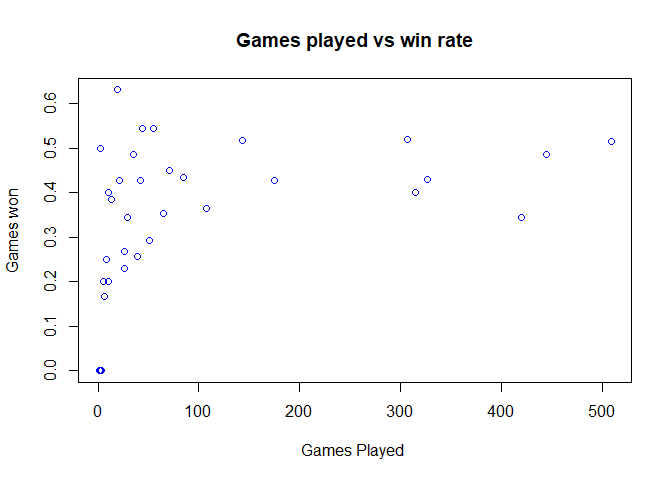
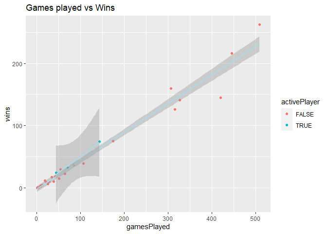
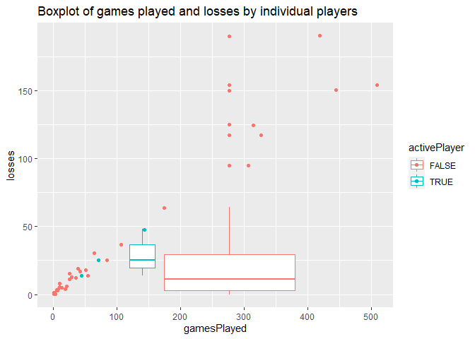
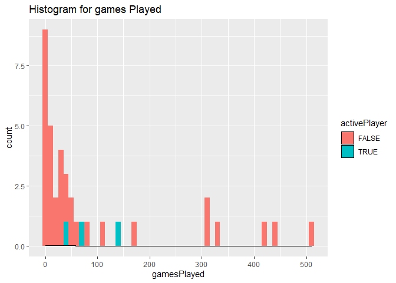
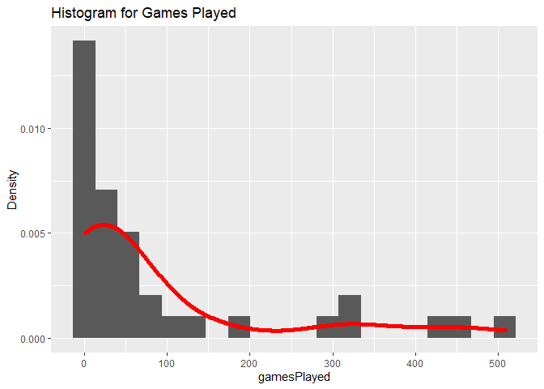
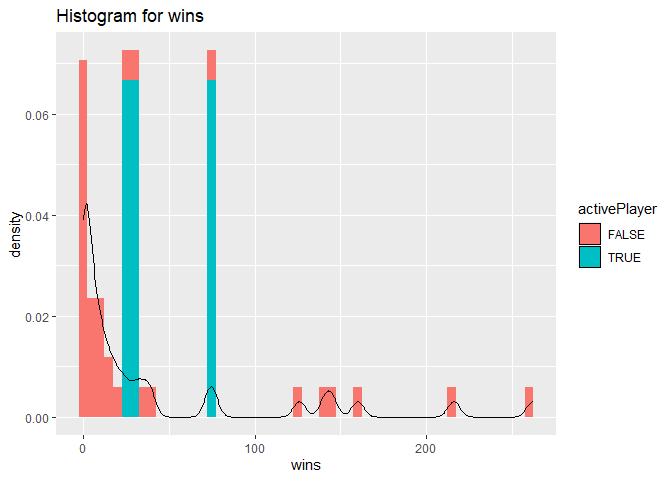
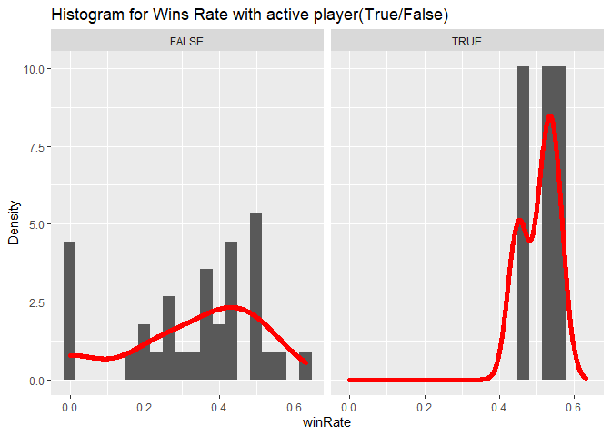

Project-1, ST558
================
Pratap Adhikari
9/18/2020

  - [Project1-ST558](#project1-st558)
      - [List of library packages](#list-of-library-packages)
      - [Function to get franchiseAPI](#function-to-get-franchiseapi)
      - [Function to get statsAPI](#function-to-get-statsapi)
      - [Overview of franchise and
        location](#overview-of-franchise-and-location)
      - [Analysis on team ID=15 (Dallas
        Stars)](#analysis-on-team-id15-dallas-stars)

## Project1-ST558

This project work involves creating a `vignette` for reading and
summarizing data from the ~~National Hockey League’s~~ (NHL) **API**.

### List of library packages

The list of library packages I have used to run this code in order to
carry on this project are:

  - knitr  
  - httr  
  - jsonlite  
  - tidyverse  
  - dplyr  
  - haven  
  - ggplot2  
  - qwraps2  
  - rmarkdown  
  - RSQlite

#### To install the packages:

install.packages(“knitr”, “httr”, “jsonlite”, “tidyverse”, “dplyr”,
“haven”, “ggplot2”, “qwraps2”, “rmarkdown”, “RSQlite”)

### Function to get franchiseAPI

``` r
#create funciton to read data from records API
nhl<- function(tabName, ID=NULL, ...){
  base_url<- "https://records.nhl.com/site/api"
  if (!is.null(tabName)){
 
     if ( tabName %in% c("franchise", "franchise-team-totals") && (!is.null(ID))){
    stop("This tab can not return with 'ID' defined")
  }
  
    if (is.null(ID)){ 
    full_url<- paste0(base_url, "/", tabName) 
  }
  
    if (!is.null(ID)){
     full_url<- paste0(base_url, "/", tabName, ID) 
  }
  get_nfl<- GET(full_url)
  txt_nfl<- content(get_nfl, "text")  # convert to JSON text form
  json_nfl<- fromJSON(txt_nfl, flatten=T) # convert to list
return(json_nfl)
  }
  else {
    return("Invalid tabName")
  }
}
```

### Function to get statsAPI

``` r
#create funciton to data from statsAPI
nhl_modifier<- function(modifier, ID=NULL,...){
  stbase_url<- "https://statsapi.web.nhl.com/api/v1/teams"
  if (modifier %in%  c("expand=team.roster", "expand=person.names", "expand=team.schedule.next", "expand=team.schedule.previous",  "expand=team.stats",  "expand=team.roster&season=20142015", "teamId=4,5,29",  "stats=statsSingleSeasonPlayoffs"))
  {
    get_st<- GET(paste0(stbase_url, "?", modifier))
st_txt<- content(get_st, "text")
json_st<- fromJSON(st_txt, flatten=T)
}
else { #return a message if the modifier is not campatible with the function
  json_st="Sorry, can't accept this modifier"
  
}
return(json_st)
}
```

``` r
nhlData<- function (tabName=NULL, modifier=NULL, ID=NULL, ...){
if (!is.null(tabName) && !is.null(modifier)){
  stop("it can not work together with tabName and modifier")
 
}  
if(is.null(tabName) && is.null(modifier) ){
    
  output<- nhl("franchise")
}
  if (is.null(modifier) && !is.null(tabName)){
     output<- nhl(tabName, ID)
     output<- output$data
  }
  # if modifier is not null and id is null
  if(!is.null(modifier) && is.null(id)){
   output<- nhl_modifier(modifier)
  }
  
  #if both modifier and id are not  null
  if(!is.null(modifier) && !is.null(id) ){
    output<- nhl_modifier(modifier)
    output<- output$teams
    output<- output %>% filter(id==ID) %>% select(id:roster.link)
    
  }
  return(output)
}
```

### Overview of franchise and location

``` r
teamtotal<- nhl(tabName = "franchise-team-totals")$data
```

    ## No encoding supplied: defaulting to UTF-8.

``` r
#getteams from another endpoint
division<- nhl_modifier(modifier = "expand=team.roster")$teams %>% select(id, division.name,  locationName, division.nameShort, conference.name) %>% rename(teamId=id)
#join the two dataset from two different APIs
newData<- left_join(teamtotal, division, by="teamId")
head(newData, n=4)
```

    ##   id activeFranchise firstSeasonId franchiseId gameTypeId gamesPlayed
    ## 1  1               1      19821983          23          2        2937
    ## 2  2               1      19821983          23          3         257
    ## 3  3               1      19721973          22          2        3732
    ## 4  4               1      19721973          22          3         294
    ##   goalsAgainst goalsFor homeLosses homeOvertimeLosses homeTies homeWins
    ## 1         8708     8647        507                 82       96      783
    ## 2          634      697         53                  0       NA       74
    ## 3        11779    11889        674                 81      170      942
    ## 4          857      935         50                  1       NA       90
    ##   lastSeasonId losses overtimeLosses penaltyMinutes pointPctg points roadLosses
    ## 1           NA   1181            162          44397    0.5330   3131        674
    ## 2           NA    120              0           4266    0.0039      2         67
    ## 3           NA   1570            159          57422    0.5115   3818        896
    ## 4           NA    133              0           5564    0.0136      8         83
    ##   roadOvertimeLosses roadTies roadWins shootoutLosses shootoutWins shutouts
    ## 1                 80      123      592             79           78      193
    ## 2                  0       NA       63              0            0       25
    ## 3                 78      177      714             67           82      167
    ## 4                  2       NA       71              0            0       12
    ##   teamId           teamName ties triCode wins division.name locationName
    ## 1      1  New Jersey Devils  219     NJD 1375  Metropolitan   New Jersey
    ## 2      1  New Jersey Devils   NA     NJD  137  Metropolitan   New Jersey
    ## 3      2 New York Islanders  347     NYI 1656  Metropolitan     New York
    ## 4      2 New York Islanders   NA     NYI  161  Metropolitan     New York
    ##   division.nameShort conference.name
    ## 1              Metro         Eastern
    ## 2              Metro         Eastern
    ## 3              Metro         Eastern
    ## 4              Metro         Eastern

``` r
# overview of after joining two datasets from two different API endpoints
kable(newData %>% select(id, franchiseId, teamName, locationName) , caption= "Franchise ID, Team Name, Location  table for your reference:")
```

|  id | franchiseId | teamName                | locationName |
| --: | ----------: | :---------------------- | :----------- |
|   1 |          23 | New Jersey Devils       | New Jersey   |
|   2 |          23 | New Jersey Devils       | New Jersey   |
|   3 |          22 | New York Islanders      | New York     |
|   4 |          22 | New York Islanders      | New York     |
|   5 |          10 | New York Rangers        | New York     |
|   6 |          10 | New York Rangers        | New York     |
|   7 |          16 | Philadelphia Flyers     | Philadelphia |
|   8 |          16 | Philadelphia Flyers     | Philadelphia |
|   9 |          17 | Pittsburgh Penguins     | Pittsburgh   |
|  10 |          17 | Pittsburgh Penguins     | Pittsburgh   |
|  11 |           6 | Boston Bruins           | Boston       |
|  12 |           6 | Boston Bruins           | Boston       |
|  13 |          19 | Buffalo Sabres          | Buffalo      |
|  14 |          19 | Buffalo Sabres          | Buffalo      |
|  15 |           1 | Montréal Canadiens      | Montréal     |
|  16 |           1 | Montréal Canadiens      | Montréal     |
|  17 |          30 | Ottawa Senators         | Ottawa       |
|  18 |          30 | Ottawa Senators         | Ottawa       |
|  19 |           5 | Toronto Maple Leafs     | Toronto      |
|  20 |           5 | Toronto Maple Leafs     | Toronto      |
|  21 |          35 | Atlanta Thrashers       | NA           |
|  22 |          35 | Atlanta Thrashers       | NA           |
|  23 |          26 | Carolina Hurricanes     | Carolina     |
|  24 |          26 | Carolina Hurricanes     | Carolina     |
|  25 |          33 | Florida Panthers        | Florida      |
|  26 |          33 | Florida Panthers        | Florida      |
|  27 |          31 | Tampa Bay Lightning     | Tampa Bay    |
|  28 |          31 | Tampa Bay Lightning     | Tampa Bay    |
|  29 |          24 | Washington Capitals     | Washington   |
|  30 |          24 | Washington Capitals     | Washington   |
|  31 |          11 | Chicago Blackhawks      | Chicago      |
|  32 |          11 | Chicago Blackhawks      | Chicago      |
|  33 |          12 | Detroit Red Wings       | Detroit      |
|  34 |          12 | Detroit Red Wings       | Detroit      |
|  35 |          34 | Nashville Predators     | Nashville    |
|  36 |          34 | Nashville Predators     | Nashville    |
|  37 |          18 | St. Louis Blues         | St. Louis    |
|  38 |          18 | St. Louis Blues         | St. Louis    |
|  39 |          21 | Calgary Flames          | Calgary      |
|  40 |          21 | Calgary Flames          | Calgary      |
|  41 |          27 | Colorado Avalanche      | Colorado     |
|  42 |          27 | Colorado Avalanche      | Colorado     |
|  43 |          25 | Edmonton Oilers         | Edmonton     |
|  44 |          25 | Edmonton Oilers         | Edmonton     |
|  45 |          20 | Vancouver Canucks       | Vancouver    |
|  46 |          20 | Vancouver Canucks       | Vancouver    |
|  47 |          32 | Anaheim Ducks           | Anaheim      |
|  48 |          32 | Anaheim Ducks           | Anaheim      |
|  49 |          15 | Dallas Stars            | Dallas       |
|  50 |          15 | Dallas Stars            | Dallas       |
|  51 |          14 | Los Angeles Kings       | Los Angeles  |
|  52 |          14 | Los Angeles Kings       | Los Angeles  |
|  53 |          28 | Phoenix Coyotes         | NA           |
|  54 |          28 | Phoenix Coyotes         | NA           |
|  55 |          29 | San Jose Sharks         | San Jose     |
|  56 |          29 | San Jose Sharks         | San Jose     |
|  57 |          36 | Columbus Blue Jackets   | Columbus     |
|  58 |          36 | Columbus Blue Jackets   | Columbus     |
|  59 |          37 | Minnesota Wild          | Minnesota    |
|  60 |          37 | Minnesota Wild          | Minnesota    |
|  61 |          15 | Minnesota North Stars   | NA           |
|  62 |          15 | Minnesota North Stars   | NA           |
|  63 |          27 | Quebec Nordiques        | NA           |
|  64 |          27 | Quebec Nordiques        | NA           |
|  65 |          28 | Winnipeg Jets (1979)    | NA           |
|  66 |          28 | Winnipeg Jets (1979)    | NA           |
|  67 |          26 | Hartford Whalers        | NA           |
|  68 |          26 | Hartford Whalers        | NA           |
|  69 |          23 | Colorado Rockies        | NA           |
|  70 |          23 | Colorado Rockies        | NA           |
|  71 |           3 | Ottawa Senators (1917)  | NA           |
|  72 |           3 | Ottawa Senators (1917)  | NA           |
|  73 |           4 | Hamilton Tigers         | NA           |
|  74 |           9 | Pittsburgh Pirates      | NA           |
|  75 |           9 | Pittsburgh Pirates      | NA           |
|  76 |           9 | Philadelphia Quakers    | NA           |
|  77 |          12 | Detroit Cougars         | NA           |
|  78 |          12 | Detroit Cougars         | NA           |
|  79 |           2 | Montreal Wanderers      | NA           |
|  80 |           4 | Quebec Bulldogs         | NA           |
|  81 |           7 | Montreal Maroons        | NA           |
|  82 |           7 | Montreal Maroons        | NA           |
|  83 |           8 | New York Americans      | NA           |
|  84 |           8 | New York Americans      | NA           |
|  85 |           3 | St. Louis Eagles        | NA           |
|  86 |          13 | Oakland Seals           | NA           |
|  87 |          13 | Oakland Seals           | NA           |
|  88 |          21 | Atlanta Flames          | NA           |
|  89 |          21 | Atlanta Flames          | NA           |
|  90 |          23 | Kansas City Scouts      | NA           |
|  91 |          13 | Cleveland Barons        | NA           |
|  92 |          12 | Detroit Falcons         | NA           |
|  93 |          12 | Detroit Falcons         | NA           |
|  94 |           8 | Brooklyn Americans      | NA           |
|  95 |          35 | Winnipeg Jets           | Winnipeg     |
|  96 |          35 | Winnipeg Jets           | Winnipeg     |
|  97 |          28 | Arizona Coyotes         | Arizona      |
|  98 |          38 | Vegas Golden Knights    | Vegas        |
|  99 |          38 | Vegas Golden Knights    | Vegas        |
| 100 |          13 | California Golden Seals | NA           |
| 101 |           5 | Toronto Arenas          | NA           |
| 102 |           5 | Toronto Arenas          | NA           |
| 103 |           5 | Toronto St. Patricks    | NA           |
| 104 |           5 | Toronto St. Patricks    | NA           |
| 105 |          28 | Arizona Coyotes         | Arizona      |

Franchise ID, Team Name, Location table for your reference:

Read table from two different APIs

``` r
dta1<- nhlData("franchise")
```

    ## No encoding supplied: defaulting to UTF-8.

``` r
dta1<- dta1 %>% select(id, mostRecentTeamId, teamCommonName, teamPlaceName) 
golietable15<- nhl(tabName  = "franchise-goalie-records?cayenneExp=franchiseId=", ID=15)$data %>% select(activePlayer, firstName, franchiseName, gamesPlayed, lastName, gameTypeId, playerId, mostGoalsAgainstOneGame, ties, wins, losses )
```

    ## No encoding supplied: defaulting to UTF-8.

### Analysis on team ID=15 (Dallas Stars)

``` r
#Create new variable by adding first and last name from two different columns
golietable15$playerName<- c(paste0(golietable15$firstName, " ", golietable15$lastName))
#select only the varaibles required to analyse the data
golietable15<- golietable15 %>% select(franchiseName, playerName, playerId, activePlayer, gameTypeId, gamesPlayed, mostGoalsAgainstOneGame, ties, wins, losses)
```

#### Categorical Summary

Table showing active players from the **Dallas** team

``` r
library(kableExtra)
```

    ## 
    ## Attaching package: 'kableExtra'

    ## The following object is masked from 'package:dplyr':
    ## 
    ##     group_rows

``` r
 freqtbl<- table (golietable15  %>% group_by(activePlayer)%>% select(franchiseName, activePlayer))
freqtbl
```

    ##               activePlayer
    ## franchiseName  FALSE TRUE
    ##   Dallas Stars    34    3

``` r
add_header_above(header = c("Franchise" = 1, "Active Player" = 2),   kable(freqtbl))
```

<table>

<thead>

<tr>

<th style="border-bottom:hidden;padding-bottom:0; padding-left:3px;padding-right:3px;text-align: center; " colspan="1">

<div style="border-bottom: 1px solid #ddd; padding-bottom: 5px; ">

Franchise

</div>

</th>

<th style="border-bottom:hidden;padding-bottom:0; padding-left:3px;padding-right:3px;text-align: center; " colspan="2">

<div style="border-bottom: 1px solid #ddd; padding-bottom: 5px; ">

Active Player

</div>

</th>

</tr>

<tr>

<th style="text-align:left;">

</th>

<th style="text-align:right;">

FALSE

</th>

<th style="text-align:right;">

TRUE

</th>

</tr>

</thead>

<tbody>

<tr>

<td style="text-align:left;">

Dallas Stars

</td>

<td style="text-align:right;">

34

</td>

<td style="text-align:right;">

3

</td>

</tr>

</tbody>

</table>

#### Contingency table

``` r
# Max goals against one game
kable( table(golietable15 %>% group_by(mostGoalsAgainstOneGame) %>% select(mostGoalsAgainstOneGame, playerName)))
```

<table>

<thead>

<tr>

<th style="text-align:left;">

</th>

<th style="text-align:right;">

Alex Auld

</th>

<th style="text-align:right;">

Allan Bester

</th>

<th style="text-align:right;">

Anders Lindback

</th>

<th style="text-align:right;">

Andrew Raycroft

</th>

<th style="text-align:right;">

Andy Moog

</th>

<th style="text-align:right;">

Anton Khudobin

</th>

<th style="text-align:right;">

Antti Niemi

</th>

<th style="text-align:right;">

Arturs Irbe

</th>

<th style="text-align:right;">

Ben Bishop

</th>

<th style="text-align:right;">

Brent Krahn

</th>

<th style="text-align:right;">

Brian Hayward

</th>

<th style="text-align:right;">

Cesare Maniago

</th>

<th style="text-align:right;">

Corey Hirsch

</th>

<th style="text-align:right;">

Cristopher Nilstorp

</th>

<th style="text-align:right;">

Daniel Berthiaume

</th>

<th style="text-align:right;">

Darcy Wakaluk

</th>

<th style="text-align:right;">

Don Beaupre

</th>

<th style="text-align:right;">

Ed Belfour

</th>

<th style="text-align:right;">

Gary Edwards

</th>

<th style="text-align:right;">

Gary Smith

</th>

<th style="text-align:right;">

Gilles Meloche

</th>

<th style="text-align:right;">

Gump Worsley

</th>

<th style="text-align:right;">

Jean Levasseur

</th>

<th style="text-align:right;">

Jhonas Enroth

</th>

<th style="text-align:right;">

Johan Hedberg

</th>

<th style="text-align:right;">

Johan Holmqvist

</th>

<th style="text-align:right;">

Jussi Rynnas

</th>

<th style="text-align:right;">

Kari Lehtonen

</th>

<th style="text-align:right;">

Lindsay Middlebrook

</th>

<th style="text-align:right;">

Markus Mattsson

</th>

<th style="text-align:right;">

Marty Turco

</th>

<th style="text-align:right;">

Mike McKenna

</th>

<th style="text-align:right;">

Mike Smith

</th>

<th style="text-align:right;">

Roland Melanson

</th>

<th style="text-align:right;">

Roman Turek

</th>

<th style="text-align:right;">

Ron Tugnutt

</th>

<th style="text-align:right;">

Tim Thomas

</th>

</tr>

</thead>

<tbody>

<tr>

<td style="text-align:left;">

3

</td>

<td style="text-align:right;">

0

</td>

<td style="text-align:right;">

0

</td>

<td style="text-align:right;">

0

</td>

<td style="text-align:right;">

0

</td>

<td style="text-align:right;">

0

</td>

<td style="text-align:right;">

0

</td>

<td style="text-align:right;">

0

</td>

<td style="text-align:right;">

0

</td>

<td style="text-align:right;">

0

</td>

<td style="text-align:right;">

1

</td>

<td style="text-align:right;">

0

</td>

<td style="text-align:right;">

0

</td>

<td style="text-align:right;">

0

</td>

<td style="text-align:right;">

0

</td>

<td style="text-align:right;">

0

</td>

<td style="text-align:right;">

0

</td>

<td style="text-align:right;">

0

</td>

<td style="text-align:right;">

0

</td>

<td style="text-align:right;">

0

</td>

<td style="text-align:right;">

0

</td>

<td style="text-align:right;">

0

</td>

<td style="text-align:right;">

0

</td>

<td style="text-align:right;">

0

</td>

<td style="text-align:right;">

0

</td>

<td style="text-align:right;">

0

</td>

<td style="text-align:right;">

1

</td>

<td style="text-align:right;">

0

</td>

<td style="text-align:right;">

0

</td>

<td style="text-align:right;">

1

</td>

<td style="text-align:right;">

0

</td>

<td style="text-align:right;">

0

</td>

<td style="text-align:right;">

0

</td>

<td style="text-align:right;">

0

</td>

<td style="text-align:right;">

0

</td>

<td style="text-align:right;">

0

</td>

<td style="text-align:right;">

0

</td>

<td style="text-align:right;">

0

</td>

</tr>

<tr>

<td style="text-align:left;">

4

</td>

<td style="text-align:right;">

0

</td>

<td style="text-align:right;">

0

</td>

<td style="text-align:right;">

0

</td>

<td style="text-align:right;">

0

</td>

<td style="text-align:right;">

0

</td>

<td style="text-align:right;">

0

</td>

<td style="text-align:right;">

0

</td>

<td style="text-align:right;">

0

</td>

<td style="text-align:right;">

0

</td>

<td style="text-align:right;">

0

</td>

<td style="text-align:right;">

0

</td>

<td style="text-align:right;">

0

</td>

<td style="text-align:right;">

1

</td>

<td style="text-align:right;">

0

</td>

<td style="text-align:right;">

1

</td>

<td style="text-align:right;">

0

</td>

<td style="text-align:right;">

0

</td>

<td style="text-align:right;">

0

</td>

<td style="text-align:right;">

0

</td>

<td style="text-align:right;">

0

</td>

<td style="text-align:right;">

0

</td>

<td style="text-align:right;">

0

</td>

<td style="text-align:right;">

0

</td>

<td style="text-align:right;">

0

</td>

<td style="text-align:right;">

0

</td>

<td style="text-align:right;">

0

</td>

<td style="text-align:right;">

0

</td>

<td style="text-align:right;">

0

</td>

<td style="text-align:right;">

0

</td>

<td style="text-align:right;">

0

</td>

<td style="text-align:right;">

0

</td>

<td style="text-align:right;">

0

</td>

<td style="text-align:right;">

1

</td>

<td style="text-align:right;">

0

</td>

<td style="text-align:right;">

0

</td>

<td style="text-align:right;">

0

</td>

<td style="text-align:right;">

1

</td>

</tr>

<tr>

<td style="text-align:left;">

5

</td>

<td style="text-align:right;">

1

</td>

<td style="text-align:right;">

1

</td>

<td style="text-align:right;">

0

</td>

<td style="text-align:right;">

0

</td>

<td style="text-align:right;">

0

</td>

<td style="text-align:right;">

0

</td>

<td style="text-align:right;">

0

</td>

<td style="text-align:right;">

0

</td>

<td style="text-align:right;">

0

</td>

<td style="text-align:right;">

0

</td>

<td style="text-align:right;">

0

</td>

<td style="text-align:right;">

0

</td>

<td style="text-align:right;">

0

</td>

<td style="text-align:right;">

1

</td>

<td style="text-align:right;">

0

</td>

<td style="text-align:right;">

0

</td>

<td style="text-align:right;">

0

</td>

<td style="text-align:right;">

0

</td>

<td style="text-align:right;">

0

</td>

<td style="text-align:right;">

0

</td>

<td style="text-align:right;">

0

</td>

<td style="text-align:right;">

0

</td>

<td style="text-align:right;">

0

</td>

<td style="text-align:right;">

0

</td>

<td style="text-align:right;">

0

</td>

<td style="text-align:right;">

0

</td>

<td style="text-align:right;">

1

</td>

<td style="text-align:right;">

0

</td>

<td style="text-align:right;">

0

</td>

<td style="text-align:right;">

0

</td>

<td style="text-align:right;">

0

</td>

<td style="text-align:right;">

1

</td>

<td style="text-align:right;">

0

</td>

<td style="text-align:right;">

0

</td>

<td style="text-align:right;">

1

</td>

<td style="text-align:right;">

1

</td>

<td style="text-align:right;">

0

</td>

</tr>

<tr>

<td style="text-align:left;">

6

</td>

<td style="text-align:right;">

0

</td>

<td style="text-align:right;">

0

</td>

<td style="text-align:right;">

1

</td>

<td style="text-align:right;">

0

</td>

<td style="text-align:right;">

0

</td>

<td style="text-align:right;">

1

</td>

<td style="text-align:right;">

1

</td>

<td style="text-align:right;">

1

</td>

<td style="text-align:right;">

1

</td>

<td style="text-align:right;">

0

</td>

<td style="text-align:right;">

1

</td>

<td style="text-align:right;">

0

</td>

<td style="text-align:right;">

0

</td>

<td style="text-align:right;">

0

</td>

<td style="text-align:right;">

0

</td>

<td style="text-align:right;">

0

</td>

<td style="text-align:right;">

0

</td>

<td style="text-align:right;">

0

</td>

<td style="text-align:right;">

0

</td>

<td style="text-align:right;">

0

</td>

<td style="text-align:right;">

0

</td>

<td style="text-align:right;">

0

</td>

<td style="text-align:right;">

0

</td>

<td style="text-align:right;">

1

</td>

<td style="text-align:right;">

1

</td>

<td style="text-align:right;">

0

</td>

<td style="text-align:right;">

0

</td>

<td style="text-align:right;">

0

</td>

<td style="text-align:right;">

0

</td>

<td style="text-align:right;">

1

</td>

<td style="text-align:right;">

1

</td>

<td style="text-align:right;">

0

</td>

<td style="text-align:right;">

0

</td>

<td style="text-align:right;">

0

</td>

<td style="text-align:right;">

0

</td>

<td style="text-align:right;">

0

</td>

<td style="text-align:right;">

0

</td>

</tr>

<tr>

<td style="text-align:left;">

7

</td>

<td style="text-align:right;">

0

</td>

<td style="text-align:right;">

0

</td>

<td style="text-align:right;">

0

</td>

<td style="text-align:right;">

1

</td>

<td style="text-align:right;">

0

</td>

<td style="text-align:right;">

0

</td>

<td style="text-align:right;">

0

</td>

<td style="text-align:right;">

0

</td>

<td style="text-align:right;">

0

</td>

<td style="text-align:right;">

0

</td>

<td style="text-align:right;">

0

</td>

<td style="text-align:right;">

0

</td>

<td style="text-align:right;">

0

</td>

<td style="text-align:right;">

0

</td>

<td style="text-align:right;">

0

</td>

<td style="text-align:right;">

0

</td>

<td style="text-align:right;">

0

</td>

<td style="text-align:right;">

0

</td>

<td style="text-align:right;">

0

</td>

<td style="text-align:right;">

0

</td>

<td style="text-align:right;">

0

</td>

<td style="text-align:right;">

1

</td>

<td style="text-align:right;">

1

</td>

<td style="text-align:right;">

0

</td>

<td style="text-align:right;">

0

</td>

<td style="text-align:right;">

0

</td>

<td style="text-align:right;">

0

</td>

<td style="text-align:right;">

1

</td>

<td style="text-align:right;">

0

</td>

<td style="text-align:right;">

0

</td>

<td style="text-align:right;">

0

</td>

<td style="text-align:right;">

0

</td>

<td style="text-align:right;">

0

</td>

<td style="text-align:right;">

0

</td>

<td style="text-align:right;">

0

</td>

<td style="text-align:right;">

0

</td>

<td style="text-align:right;">

0

</td>

</tr>

<tr>

<td style="text-align:left;">

8

</td>

<td style="text-align:right;">

0

</td>

<td style="text-align:right;">

0

</td>

<td style="text-align:right;">

0

</td>

<td style="text-align:right;">

0

</td>

<td style="text-align:right;">

0

</td>

<td style="text-align:right;">

0

</td>

<td style="text-align:right;">

0

</td>

<td style="text-align:right;">

0

</td>

<td style="text-align:right;">

0

</td>

<td style="text-align:right;">

0

</td>

<td style="text-align:right;">

0

</td>

<td style="text-align:right;">

0

</td>

<td style="text-align:right;">

0

</td>

<td style="text-align:right;">

0

</td>

<td style="text-align:right;">

0

</td>

<td style="text-align:right;">

1

</td>

<td style="text-align:right;">

0

</td>

<td style="text-align:right;">

1

</td>

<td style="text-align:right;">

1

</td>

<td style="text-align:right;">

0

</td>

<td style="text-align:right;">

1

</td>

<td style="text-align:right;">

0

</td>

<td style="text-align:right;">

0

</td>

<td style="text-align:right;">

0

</td>

<td style="text-align:right;">

0

</td>

<td style="text-align:right;">

0

</td>

<td style="text-align:right;">

0

</td>

<td style="text-align:right;">

0

</td>

<td style="text-align:right;">

0

</td>

<td style="text-align:right;">

0

</td>

<td style="text-align:right;">

0

</td>

<td style="text-align:right;">

0

</td>

<td style="text-align:right;">

0

</td>

<td style="text-align:right;">

1

</td>

<td style="text-align:right;">

0

</td>

<td style="text-align:right;">

0

</td>

<td style="text-align:right;">

0

</td>

</tr>

<tr>

<td style="text-align:left;">

10

</td>

<td style="text-align:right;">

0

</td>

<td style="text-align:right;">

0

</td>

<td style="text-align:right;">

0

</td>

<td style="text-align:right;">

0

</td>

<td style="text-align:right;">

1

</td>

<td style="text-align:right;">

0

</td>

<td style="text-align:right;">

0

</td>

<td style="text-align:right;">

0

</td>

<td style="text-align:right;">

0

</td>

<td style="text-align:right;">

0

</td>

<td style="text-align:right;">

0

</td>

<td style="text-align:right;">

1

</td>

<td style="text-align:right;">

0

</td>

<td style="text-align:right;">

0

</td>

<td style="text-align:right;">

0

</td>

<td style="text-align:right;">

0

</td>

<td style="text-align:right;">

1

</td>

<td style="text-align:right;">

0

</td>

<td style="text-align:right;">

0

</td>

<td style="text-align:right;">

1

</td>

<td style="text-align:right;">

0

</td>

<td style="text-align:right;">

0

</td>

<td style="text-align:right;">

0

</td>

<td style="text-align:right;">

0

</td>

<td style="text-align:right;">

0

</td>

<td style="text-align:right;">

0

</td>

<td style="text-align:right;">

0

</td>

<td style="text-align:right;">

0

</td>

<td style="text-align:right;">

0

</td>

<td style="text-align:right;">

0

</td>

<td style="text-align:right;">

0

</td>

<td style="text-align:right;">

0

</td>

<td style="text-align:right;">

0

</td>

<td style="text-align:right;">

0

</td>

<td style="text-align:right;">

0

</td>

<td style="text-align:right;">

0

</td>

<td style="text-align:right;">

0

</td>

</tr>

</tbody>

</table>

#### Win/Loss Rate

``` r
#create new variables 
wlRate<- golietable15 %>% mutate(tiesRate= round(ties/gamesPlayed, 2), winRate= round(wins/gamesPlayed, 2) , lossRate= round(losses/gamesPlayed,2), MissedClcn= 1-(tiesRate+winRate+lossRate) ) %>% select(playerName, playerId, gameTypeId, gamesPlayed, activePlayer, winRate, lossRate, MissedClcn)
kable(wlRate)
```

<table>

<thead>

<tr>

<th style="text-align:left;">

playerName

</th>

<th style="text-align:right;">

playerId

</th>

<th style="text-align:right;">

gameTypeId

</th>

<th style="text-align:right;">

gamesPlayed

</th>

<th style="text-align:left;">

activePlayer

</th>

<th style="text-align:right;">

winRate

</th>

<th style="text-align:right;">

lossRate

</th>

<th style="text-align:right;">

MissedClcn

</th>

</tr>

</thead>

<tbody>

<tr>

<td style="text-align:left;">

Don Beaupre

</td>

<td style="text-align:right;">

8445381

</td>

<td style="text-align:right;">

2

</td>

<td style="text-align:right;">

315

</td>

<td style="text-align:left;">

FALSE

</td>

<td style="text-align:right;">

0.40

</td>

<td style="text-align:right;">

0.40

</td>

<td style="text-align:right;">

0.06

</td>

</tr>

<tr>

<td style="text-align:left;">

Cesare Maniago

</td>

<td style="text-align:right;">

8450020

</td>

<td style="text-align:right;">

2

</td>

<td style="text-align:right;">

420

</td>

<td style="text-align:left;">

FALSE

</td>

<td style="text-align:right;">

0.35

</td>

<td style="text-align:right;">

0.45

</td>

<td style="text-align:right;">

0.03

</td>

</tr>

<tr>

<td style="text-align:left;">

Marty Turco

</td>

<td style="text-align:right;">

8460612

</td>

<td style="text-align:right;">

2

</td>

<td style="text-align:right;">

509

</td>

<td style="text-align:left;">

FALSE

</td>

<td style="text-align:right;">

0.51

</td>

<td style="text-align:right;">

0.30

</td>

<td style="text-align:right;">

0.14

</td>

</tr>

<tr>

<td style="text-align:left;">

Kari Lehtonen

</td>

<td style="text-align:right;">

8470140

</td>

<td style="text-align:right;">

2

</td>

<td style="text-align:right;">

445

</td>

<td style="text-align:left;">

FALSE

</td>

<td style="text-align:right;">

0.49

</td>

<td style="text-align:right;">

0.34

</td>

<td style="text-align:right;">

0.17

</td>

</tr>

<tr>

<td style="text-align:left;">

Ed Belfour

</td>

<td style="text-align:right;">

8445386

</td>

<td style="text-align:right;">

2

</td>

<td style="text-align:right;">

307

</td>

<td style="text-align:left;">

FALSE

</td>

<td style="text-align:right;">

0.52

</td>

<td style="text-align:right;">

0.31

</td>

<td style="text-align:right;">

0.03

</td>

</tr>

<tr>

<td style="text-align:left;">

Allan Bester

</td>

<td style="text-align:right;">

8445458

</td>

<td style="text-align:right;">

2

</td>

<td style="text-align:right;">

10

</td>

<td style="text-align:left;">

FALSE

</td>

<td style="text-align:right;">

0.40

</td>

<td style="text-align:right;">

0.50

</td>

<td style="text-align:right;">

0.00

</td>

</tr>

<tr>

<td style="text-align:left;">

Daniel Berthiaume

</td>

<td style="text-align:right;">

8445462

</td>

<td style="text-align:right;">

2

</td>

<td style="text-align:right;">

5

</td>

<td style="text-align:left;">

FALSE

</td>

<td style="text-align:right;">

0.20

</td>

<td style="text-align:right;">

0.60

</td>

<td style="text-align:right;">

0.20

</td>

</tr>

<tr>

<td style="text-align:left;">

Gary Edwards

</td>

<td style="text-align:right;">

8446602

</td>

<td style="text-align:right;">

2

</td>

<td style="text-align:right;">

51

</td>

<td style="text-align:left;">

FALSE

</td>

<td style="text-align:right;">

0.29

</td>

<td style="text-align:right;">

0.35

</td>

<td style="text-align:right;">

0.07

</td>

</tr>

<tr>

<td style="text-align:left;">

Brian Hayward

</td>

<td style="text-align:right;">

8447701

</td>

<td style="text-align:right;">

2

</td>

<td style="text-align:right;">

26

</td>

<td style="text-align:left;">

FALSE

</td>

<td style="text-align:right;">

0.23

</td>

<td style="text-align:right;">

0.58

</td>

<td style="text-align:right;">

0.07

</td>

</tr>

<tr>

<td style="text-align:left;">

Jean Levasseur

</td>

<td style="text-align:right;">

8448807

</td>

<td style="text-align:right;">

2

</td>

<td style="text-align:right;">

1

</td>

<td style="text-align:left;">

FALSE

</td>

<td style="text-align:right;">

0.00

</td>

<td style="text-align:right;">

1.00

</td>

<td style="text-align:right;">

0.00

</td>

</tr>

<tr>

<td style="text-align:left;">

Markus Mattsson

</td>

<td style="text-align:right;">

8449291

</td>

<td style="text-align:right;">

2

</td>

<td style="text-align:right;">

2

</td>

<td style="text-align:left;">

FALSE

</td>

<td style="text-align:right;">

0.50

</td>

<td style="text-align:right;">

0.50

</td>

<td style="text-align:right;">

0.00

</td>

</tr>

<tr>

<td style="text-align:left;">

Roland Melanson

</td>

<td style="text-align:right;">

8449547

</td>

<td style="text-align:right;">

2

</td>

<td style="text-align:right;">

26

</td>

<td style="text-align:left;">

FALSE

</td>

<td style="text-align:right;">

0.27

</td>

<td style="text-align:right;">

0.42

</td>

<td style="text-align:right;">

0.12

</td>

</tr>

<tr>

<td style="text-align:left;">

Gilles Meloche

</td>

<td style="text-align:right;">

8449550

</td>

<td style="text-align:right;">

2

</td>

<td style="text-align:right;">

327

</td>

<td style="text-align:left;">

FALSE

</td>

<td style="text-align:right;">

0.43

</td>

<td style="text-align:right;">

0.36

</td>

<td style="text-align:right;">

0.05

</td>

</tr>

<tr>

<td style="text-align:left;">

Lindsay Middlebrook

</td>

<td style="text-align:right;">

8449588

</td>

<td style="text-align:right;">

2

</td>

<td style="text-align:right;">

3

</td>

<td style="text-align:left;">

FALSE

</td>

<td style="text-align:right;">

0.00

</td>

<td style="text-align:right;">

0.00

</td>

<td style="text-align:right;">

0.33

</td>

</tr>

<tr>

<td style="text-align:left;">

Andy Moog

</td>

<td style="text-align:right;">

8449681

</td>

<td style="text-align:right;">

2

</td>

<td style="text-align:right;">

175

</td>

<td style="text-align:left;">

FALSE

</td>

<td style="text-align:right;">

0.43

</td>

<td style="text-align:right;">

0.37

</td>

<td style="text-align:right;">

0.05

</td>

</tr>

<tr>

<td style="text-align:left;">

Gump Worsley

</td>

<td style="text-align:right;">

8450152

</td>

<td style="text-align:right;">

2

</td>

<td style="text-align:right;">

107

</td>

<td style="text-align:left;">

FALSE

</td>

<td style="text-align:right;">

0.36

</td>

<td style="text-align:right;">

0.35

</td>

<td style="text-align:right;">

0.07

</td>

</tr>

<tr>

<td style="text-align:left;">

Gary Smith

</td>

<td style="text-align:right;">

8451528

</td>

<td style="text-align:right;">

2

</td>

<td style="text-align:right;">

39

</td>

<td style="text-align:left;">

FALSE

</td>

<td style="text-align:right;">

0.26

</td>

<td style="text-align:right;">

0.49

</td>

<td style="text-align:right;">

0.02

</td>

</tr>

<tr>

<td style="text-align:left;">

Ron Tugnutt

</td>

<td style="text-align:right;">

8451837

</td>

<td style="text-align:right;">

2

</td>

<td style="text-align:right;">

42

</td>

<td style="text-align:left;">

FALSE

</td>

<td style="text-align:right;">

0.43

</td>

<td style="text-align:right;">

0.40

</td>

<td style="text-align:right;">

0.05

</td>

</tr>

<tr>

<td style="text-align:left;">

Darcy Wakaluk

</td>

<td style="text-align:right;">

8452248

</td>

<td style="text-align:right;">

2

</td>

<td style="text-align:right;">

65

</td>

<td style="text-align:left;">

FALSE

</td>

<td style="text-align:right;">

0.35

</td>

<td style="text-align:right;">

0.48

</td>

<td style="text-align:right;">

0.08

</td>

</tr>

<tr>

<td style="text-align:left;">

Arturs Irbe

</td>

<td style="text-align:right;">

8456692

</td>

<td style="text-align:right;">

2

</td>

<td style="text-align:right;">

35

</td>

<td style="text-align:left;">

FALSE

</td>

<td style="text-align:right;">

0.49

</td>

<td style="text-align:right;">

0.34

</td>

<td style="text-align:right;">

0.08

</td>

</tr>

<tr>

<td style="text-align:left;">

Roman Turek

</td>

<td style="text-align:right;">

8458266

</td>

<td style="text-align:right;">

2

</td>

<td style="text-align:right;">

55

</td>

<td style="text-align:left;">

FALSE

</td>

<td style="text-align:right;">

0.55

</td>

<td style="text-align:right;">

0.25

</td>

<td style="text-align:right;">

0.13

</td>

</tr>

<tr>

<td style="text-align:left;">

Corey Hirsch

</td>

<td style="text-align:right;">

8458680

</td>

<td style="text-align:right;">

2

</td>

<td style="text-align:right;">

2

</td>

<td style="text-align:left;">

FALSE

</td>

<td style="text-align:right;">

0.00

</td>

<td style="text-align:right;">

0.50

</td>

<td style="text-align:right;">

0.50

</td>

</tr>

<tr>

<td style="text-align:left;">

Tim Thomas

</td>

<td style="text-align:right;">

8460703

</td>

<td style="text-align:right;">

2

</td>

<td style="text-align:right;">

8

</td>

<td style="text-align:left;">

FALSE

</td>

<td style="text-align:right;">

0.25

</td>

<td style="text-align:right;">

0.50

</td>

<td style="text-align:right;">

NA

</td>

</tr>

<tr>

<td style="text-align:left;">

Johan Hedberg

</td>

<td style="text-align:right;">

8460704

</td>

<td style="text-align:right;">

2

</td>

<td style="text-align:right;">

19

</td>

<td style="text-align:left;">

FALSE

</td>

<td style="text-align:right;">

0.63

</td>

<td style="text-align:right;">

0.21

</td>

<td style="text-align:right;">

NA

</td>

</tr>

<tr>

<td style="text-align:left;">

Johan Holmqvist

</td>

<td style="text-align:right;">

8466303

</td>

<td style="text-align:right;">

2

</td>

<td style="text-align:right;">

2

</td>

<td style="text-align:left;">

FALSE

</td>

<td style="text-align:right;">

0.50

</td>

<td style="text-align:right;">

0.00

</td>

<td style="text-align:right;">

NA

</td>

</tr>

<tr>

<td style="text-align:left;">

Andrew Raycroft

</td>

<td style="text-align:right;">

8467453

</td>

<td style="text-align:right;">

2

</td>

<td style="text-align:right;">

29

</td>

<td style="text-align:left;">

FALSE

</td>

<td style="text-align:right;">

0.34

</td>

<td style="text-align:right;">

0.45

</td>

<td style="text-align:right;">

NA

</td>

</tr>

<tr>

<td style="text-align:left;">

Alex Auld

</td>

<td style="text-align:right;">

8467913

</td>

<td style="text-align:right;">

2

</td>

<td style="text-align:right;">

21

</td>

<td style="text-align:left;">

FALSE

</td>

<td style="text-align:right;">

0.43

</td>

<td style="text-align:right;">

0.29

</td>

<td style="text-align:right;">

NA

</td>

</tr>

<tr>

<td style="text-align:left;">

Brent Krahn

</td>

<td style="text-align:right;">

8468489

</td>

<td style="text-align:right;">

2

</td>

<td style="text-align:right;">

1

</td>

<td style="text-align:left;">

FALSE

</td>

<td style="text-align:right;">

0.00

</td>

<td style="text-align:right;">

0.00

</td>

<td style="text-align:right;">

NA

</td>

</tr>

<tr>

<td style="text-align:left;">

Mike McKenna

</td>

<td style="text-align:right;">

8470093

</td>

<td style="text-align:right;">

2

</td>

<td style="text-align:right;">

2

</td>

<td style="text-align:left;">

FALSE

</td>

<td style="text-align:right;">

0.50

</td>

<td style="text-align:right;">

0.50

</td>

<td style="text-align:right;">

0.00

</td>

</tr>

<tr>

<td style="text-align:left;">

Ben Bishop

</td>

<td style="text-align:right;">

8471750

</td>

<td style="text-align:right;">

2

</td>

<td style="text-align:right;">

143

</td>

<td style="text-align:left;">

TRUE

</td>

<td style="text-align:right;">

0.52

</td>

<td style="text-align:right;">

0.34

</td>

<td style="text-align:right;">

0.14

</td>

</tr>

<tr>

<td style="text-align:left;">

Jhonas Enroth

</td>

<td style="text-align:right;">

8473523

</td>

<td style="text-align:right;">

2

</td>

<td style="text-align:right;">

13

</td>

<td style="text-align:left;">

FALSE

</td>

<td style="text-align:right;">

0.38

</td>

<td style="text-align:right;">

0.38

</td>

<td style="text-align:right;">

NA

</td>

</tr>

<tr>

<td style="text-align:left;">

Antti Niemi

</td>

<td style="text-align:right;">

8474550

</td>

<td style="text-align:right;">

2

</td>

<td style="text-align:right;">

85

</td>

<td style="text-align:left;">

FALSE

</td>

<td style="text-align:right;">

0.44

</td>

<td style="text-align:right;">

0.29

</td>

<td style="text-align:right;">

NA

</td>

</tr>

<tr>

<td style="text-align:left;">

Anders Lindback

</td>

<td style="text-align:right;">

8474765

</td>

<td style="text-align:right;">

2

</td>

<td style="text-align:right;">

10

</td>

<td style="text-align:left;">

FALSE

</td>

<td style="text-align:right;">

0.20

</td>

<td style="text-align:right;">

0.80

</td>

<td style="text-align:right;">

NA

</td>

</tr>

<tr>

<td style="text-align:left;">

Jussi Rynnas

</td>

<td style="text-align:right;">

8475680

</td>

<td style="text-align:right;">

2

</td>

<td style="text-align:right;">

2

</td>

<td style="text-align:left;">

FALSE

</td>

<td style="text-align:right;">

0.00

</td>

<td style="text-align:right;">

0.50

</td>

<td style="text-align:right;">

NA

</td>

</tr>

<tr>

<td style="text-align:left;">

Cristopher Nilstorp

</td>

<td style="text-align:right;">

8476846

</td>

<td style="text-align:right;">

2

</td>

<td style="text-align:right;">

6

</td>

<td style="text-align:left;">

FALSE

</td>

<td style="text-align:right;">

0.17

</td>

<td style="text-align:right;">

0.50

</td>

<td style="text-align:right;">

NA

</td>

</tr>

<tr>

<td style="text-align:left;">

Mike Smith

</td>

<td style="text-align:right;">

8469608

</td>

<td style="text-align:right;">

2

</td>

<td style="text-align:right;">

44

</td>

<td style="text-align:left;">

TRUE

</td>

<td style="text-align:right;">

0.55

</td>

<td style="text-align:right;">

0.32

</td>

<td style="text-align:right;">

NA

</td>

</tr>

<tr>

<td style="text-align:left;">

Anton Khudobin

</td>

<td style="text-align:right;">

8471418

</td>

<td style="text-align:right;">

2

</td>

<td style="text-align:right;">

71

</td>

<td style="text-align:left;">

TRUE

</td>

<td style="text-align:right;">

0.45

</td>

<td style="text-align:right;">

0.35

</td>

<td style="text-align:right;">

0.20

</td>

</tr>

</tbody>

</table>

#### Sumamry table

Numeric Summary

``` r
sumry<- function (x, ...){
  dta<- wlRate %>% filter(gameTypeId == x) %>% select(winRate, lossRate)
  if (x==2) type<- "regular season" else type<- "play off season"
  kable (apply(dta, 2, summary), format="html", digit =4, caption = paste0("Summary among all of the players"))
}
# Regular season summary
sumry(2)
```

<table>

<caption>

Summary among all of the players

</caption>

<thead>

<tr>

<th style="text-align:left;">

</th>

<th style="text-align:right;">

winRate

</th>

<th style="text-align:right;">

lossRate

</th>

</tr>

</thead>

<tbody>

<tr>

<td style="text-align:left;">

Min.

</td>

<td style="text-align:right;">

0.0000

</td>

<td style="text-align:right;">

0.0000

</td>

</tr>

<tr>

<td style="text-align:left;">

1st Qu.

</td>

<td style="text-align:right;">

0.2500

</td>

<td style="text-align:right;">

0.3200

</td>

</tr>

<tr>

<td style="text-align:left;">

Median

</td>

<td style="text-align:right;">

0.4000

</td>

<td style="text-align:right;">

0.3800

</td>

</tr>

<tr>

<td style="text-align:left;">

Mean

</td>

<td style="text-align:right;">

0.3465

</td>

<td style="text-align:right;">

0.3978

</td>

</tr>

<tr>

<td style="text-align:left;">

3rd Qu.

</td>

<td style="text-align:right;">

0.4900

</td>

<td style="text-align:right;">

0.5000

</td>

</tr>

<tr>

<td style="text-align:left;">

Max.

</td>

<td style="text-align:right;">

0.6300

</td>

<td style="text-align:right;">

1.0000

</td>

</tr>

</tbody>

</table>

Sumamry of number of games played

``` r
gpl<- golietable15 %>% select(gamesPlayed, wins)
kable (apply(gpl, 2, summary) )
```

<table>

<thead>

<tr>

<th style="text-align:left;">

</th>

<th style="text-align:right;">

gamesPlayed

</th>

<th style="text-align:right;">

wins

</th>

</tr>

</thead>

<tbody>

<tr>

<td style="text-align:left;">

Min.

</td>

<td style="text-align:right;">

1.00000

</td>

<td style="text-align:right;">

0.0000

</td>

</tr>

<tr>

<td style="text-align:left;">

1st Qu.

</td>

<td style="text-align:right;">

6.00000

</td>

<td style="text-align:right;">

1.0000

</td>

</tr>

<tr>

<td style="text-align:left;">

Median

</td>

<td style="text-align:right;">

29.00000

</td>

<td style="text-align:right;">

10.0000

</td>

</tr>

<tr>

<td style="text-align:left;">

Mean

</td>

<td style="text-align:right;">

92.51351

</td>

<td style="text-align:right;">

40.7027

</td>

</tr>

<tr>

<td style="text-align:left;">

3rd Qu.

</td>

<td style="text-align:right;">

85.00000

</td>

<td style="text-align:right;">

37.0000

</td>

</tr>

<tr>

<td style="text-align:left;">

Max.

</td>

<td style="text-align:right;">

509.00000

</td>

<td style="text-align:right;">

262.0000

</td>

</tr>

</tbody>

</table>

#### Plots

Every plot I am trying to show the plot difference and advanced options
available to plot the same plots. \#\#\#\#\# Scatter

The higest win rate is the individuals who have played less games. But
importently, higher number of games player looks like they are more
consistent in winnig rate than the lower number of games player.

``` r
#scalter plot
plot(golietable15$gamesPlayed, golietable15$wins/golietable15$gamesPlayed , col="blue",
     xlab="Games Played ",
     ylab = "Games won",
     main = "Games played vs win rate")
```

<!-- -->

The active players has larger width, which can be the effect of very
lower number of players .

``` r
ggplot (golietable15, aes(x=gamesPlayed, y=wins, group=activePlayer)) + geom_point(aes(color= activePlayer)) + geom_smooth(method='lm', color='light blue') + ggtitle("Games played vs Wins")
```

    ## `geom_smooth()` using formula 'y ~ x'

<!-- -->

##### Box plot

The players not tagged as active players looks to have loose the higest
number of games. But in the median number of games lost is higher for
active players.

``` r
#box plot
bxPlot1<- ggplot(data= golietable15, aes(x=gamesPlayed, y= losses, group=activePlayer, color=activePlayer))
bxPlot1 + geom_boxplot() + labs(title="Boxplot of games played and losses by individual players") + geom_jitter(aes(color=activePlayer))
```

<!-- -->

##### Bar plots

Again, there are very few, less than 5 players are categorized as active
player, which seems unreal.

``` r
type2<-  golietable15 %>% select(playerName, gamesPlayed, wins, activePlayer, gameTypeId)
barPlot1<- ggplot(data=type2, aes(x=activePlayer))
barPlot1 + geom_bar(aes(fill= activePlayer), position = "dodge") + labs(title = "Bar plot about active/inactive players")
```

<!-- -->

##### Histogram

The histogram for games played grahp shows that there are very few
players playing the regular season who are tagged as active player. They
seem to be played between 40 to 150 games throught their entire career
for the data collected period. Also, it shwos there are large group of
players who played less than 5 games.the different color is contribution
of two categorized playes as active or not.The distribution is extremely
right skwed

``` r
type3<- golietable15 %>% select(wins, losses, activePlayer, gamesPlayed) #(gameTypeId==3,
histogram1<- ggplot(data=type3, aes(x=gamesPlayed))
histogram1 + geom_histogram(binwidth = 10, aes(fill= activePlayer)) + labs(title="Histogram for games Played") +
  geom_density(adjust= 0.25, alpha=0.05)
```

<!-- --> The
histogram looks extremly right skewed that the players playing higher
number of games are lesser

``` r
ggplot(golietable15, aes(x=gamesPlayed, ..density..)) + geom_histogram(bins=20) + ggtitle("Histogram for Games Played") + ylab("Density") + geom_density(col="red", lwd=2, adjust=2)
```

<!-- --> Again,
the different color is contribution of two categorized playes as active
or not.

``` r
type3<- golietable15 %>% select(wins, losses, activePlayer, gamesPlayed, playerId) #(gameTypeId==3, division.name=="Atlantic") 
histogram1<- ggplot(data=type3, aes(x=wins))
histogram1 + geom_histogram(binwidth = 5, aes(y=..density.., fill= activePlayer )) + labs(title="Histogram for wins") +  geom_density(adjust= 0.3, alpha=0.05)
```

<!-- -->

For the shake of try, the above histograms does not look preety well
distributed data, so I tried below to see it on win rates, a calculated
variable. The win rate is left skewed.

``` r
hist(wlRate$winRate, probability = T, col = "light blue", xlab = "Win Rate", main = "Histogram of Win Rate (wins/gameplayed)")
```

<!-- -->

``` r
ggplot (wlRate, aes(x=winRate, ..density..)) + geom_histogram(bins=20) + facet_wrap(golietable15$activePlayer) + ggtitle("Histogram for Wins Rate with active player(True/False)") + ylab("Density") + geom_density(col="red", lwd=2, adjust=1)
```

<!-- -->
